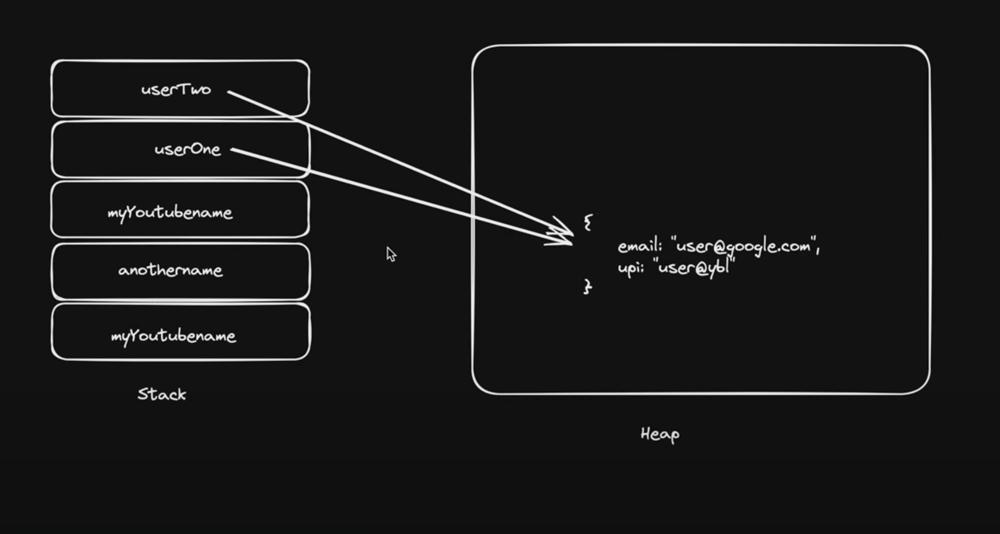
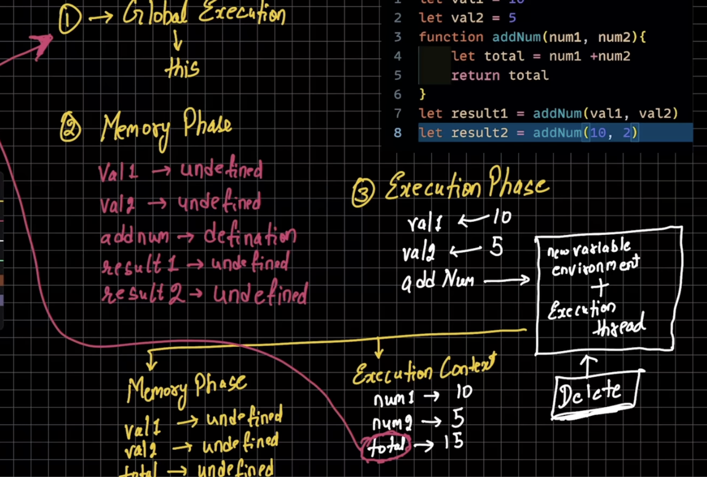
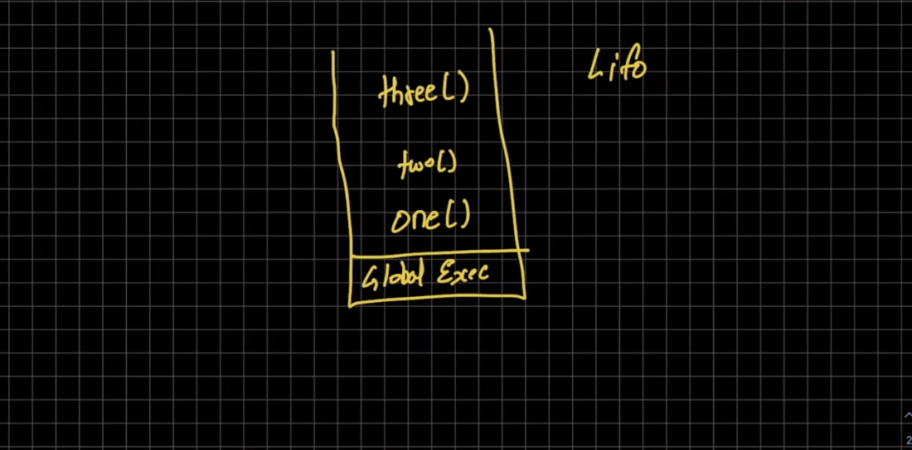

#JavaScript

@ with using nodejs environment  
@ null is object  
@ undefined is undefined  

## datatype summary
<ol>
<li>Primitive</li>
7 Types:
<ul>
    <li> String</li>
    <li> Number</li>
    <li> Boolean</li>
    <li> Null</li>
    <li> Undefined</li>
    <li> Symbol</li>
    <li> BigInt</li>
</ul>
<li>js is dyamic</li>
<li> Reference(non- primitive) </li>
    Array, Object, functions
    <ul>
    <li>Array</li>
    const heros = ['123', 23]
    <li> object</li>
    let myObj = {
        name:"ayush"
        age: 22
    }
    <li> functions</li>
    const myFunctions = functions(){
        console.log("Hello world")
    }
    </ul>
<li> typeof </li>
</ol>
## Stack(Primitive), Heap(Non-Primitive)

 
## How to js work behing

## Call Stack

# DOM

<li>by default htmlcollection we get using doucment.(attribute)</li>

selected methods

<li>documents.getElementById('id')</li>
<li>documents.getElementById('id').innerHTML = "Text"</li>
node list vs htmlCollections 

